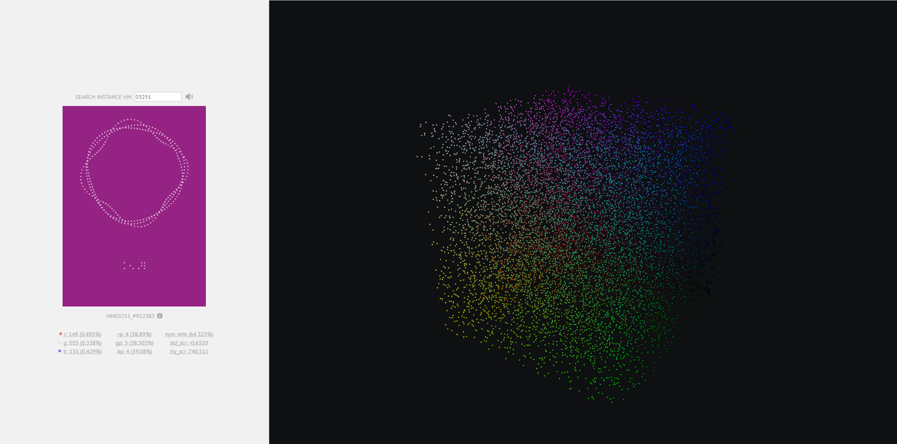

# Hypermodal

Visualized at [hypermodal.io](https://hypermodal.io)

At the intersection of time and non-time, space and non-space, a perception caused a hyper-wavefunction to collapse whose concurrent measurement yielded what we experience as relatively probable physical spacetime. A perceiving entity can thus implicitly derive that perception itself a fundamental property of matter/non-matter. The purpose of this collection, then, is to explore perception, and its unique ability to identify and organize energetic expressions, as well as their asymptotes. Specifically, the discretization of senses imply a change of state relative to a perceiving entity, yet that entity can organize energy in the form of sentience to augment its perception and identify new combined modes of truth. A hypermode represents one such subset of this action by identifying the asymptote between the perception of color, and the perception of sound, then running these inputs through a cognitive transfer function whose output allows humanity to physically experience a synthesized intersection, and thus precisely identify the true asymptote. In physical space, a hypermode embodies a chaos-derived pseudorandomly generated color whose three color-channel intensities control the frequencies of three independent sinusoidal oscillators. These oscillators are visualized as intertwined De Broglie matter waves whose movement and sound are directly proportional to the color space generating them. This limited collection of 12,129 hypermodes reside in a 3-dimensional color volume visualized at hypermodal.io, where each color and its respective audible properties can be explored. Please note, all hypermodes maintain the ability to augment your perception. Our sincerest welcome to Earth, please enjoy a substantive stay.

Note: The nature of this project dictates that some lower frequencies will be difficult and sometimes impossible to hear. To stay true to intent, these will not be altered. A speaker system or headphones with low frequency response is recommended.
